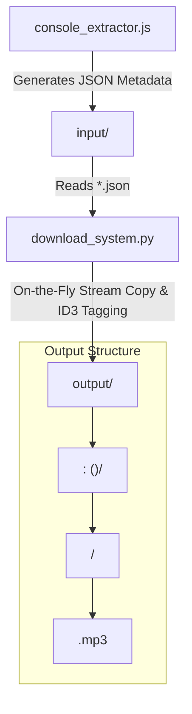

# Project Architecture: brain-fm-scraper-neo

## Overview
`brain-fm-scraper-neo` is a tool for extracting metadata, downloading, tagging, and organizing audio streams from Brain.fm.

## Workspace Map

## Core Directories & Files

- **`console_extractor.js`**: In-browser JavaScript snippet to extract track metadata and download JSON files.
- **`download_system.py`**: Python script that reads JSON metadata from `input/`, downloads audio streams and cover art on-the-fly, processes ID3v2 tags and attached artwork via `ffmpeg`, and outputs directly into `output/`.
- **`input/`**: Directory containing JSON metadata input files exported from Brain.fm.
- **`output/`**: Directory containing fully tagged MP3 tracks organized by activity, sub-activity, neural effect, and genre.

## Key Workflows

### 1. Metadata Extraction
Run `console_extractor.js` in the browser console on Brain.fm to gather track metadata. Export and save the JSON files into the `input/` folder.

### 2. On-The-Fly Processing & Tagging
Run `download_system.py` (interactively or with CLI options `-i input -o output`).
- Scans `input/*.json`
- Downloads audio stream using `aria2c` to a temporary buffer.
- Downloads and center-crops cover art image to standard dimensions.
- Embeds ID3v2 metadata (Title, Album, Artist, Genre, TXXX attributes) and attached cover art using `ffmpeg`.
- Saves finalized `.mp3` directly to:
  `output/<Activity>:<Sub-activity> (<Neural Effect>)/<Genre>/<Safe Title>.mp3`
